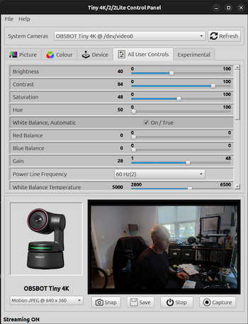
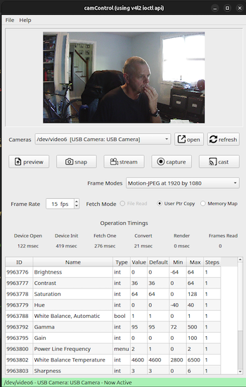

# Installation Support

- This document supports tiny4kPanel and camControl linux applications (installable on Debian/Ubuntu/Rapbian OSs, with AMD64 or ARM64 processors)
- Installation scripts support any APT-based package management systems.
- UVC camera access is based on [Video4Linux](https://www.kernel.org/doc/html/v4.9/media/uapi/v4l/v4l2.html) api and the [V4l2Camera](https://github.com/danlargo/v4l2Camera) open source project.

---

# Installation Details

## *camControl*

### AMD64 Install
Download [camControl.amd64.deb](./camControl/amd64/camControl.amd64.deb)
> [!IMPORTANT]
> sha256checksum : 4f6d1aaee526e75387a1e28b0f10d12e3c461ecc5d0f8382bfc99984a6e7e0c0

- built and tested on Ubuntu 24.04.1 LTS, Intel(R) Core(TM) i5-7600K CPU @ 3.80Ghz
- contains binary and desktop config files to install launch icon in Ubuntu/Debian desktop

- installation command :
```
sudo apt-get install ./camControl.amd64.deb
```

### ARM64 Install - Generic
Download [camControl.arm64.deb](./camControl/arm64/camControl.arm64.deb)
> [!IMPORTANT]
> sha256checksum : 

- built and tested on Raspbian (Debian GNU/Linux 12 (bookworm)), ARM64 Cortex-A76 CPU @ 2.4Ghz (Pi5)
- contains binary and desktop config files to install launch icon in Ubuntu/Debian desktop

- installation command :
```
sudo apt-get install ./camControl.arm64.deb
```

### ARM64 Install - Raspberry Pi
Download [camControl.raspbian.deb](./camControl/raspbian-arm64/camControl.raspbian.deb)
> [!IMPORTANT]
> sha256checksum : 

- built and tested on Raspbian (Debian GNU/Linux 12 (bookworm)), ARM64 Cortex-A76 CPU @ 2.4Ghz (Pi5)
- contains binary and will install in /home/pi/Desktop, no desktop menu config files (this is the only difference between the two ARM64 installers)

- installation command :
```
sudo apt-get install ./camControl.raspbian.deb
```


## *tiny4kPanel*

### AMD64 Install
Download [tiny4kPanel.amd64.deb](./tiny4kPanel/amd64/tiny4kpanel.amd64.deb)
> [!IMPORTANT]
> sha256checksum : 4f6d1aaee526e75387a1e28b0f10d12e3c461ecc5d0f8382bfc99984a6e7e0c0

- built and tested on Ubuntu 24.04.1 LTS, Intel(R) Core(TM) i5-7600K CPU @ 3.80Ghz
- contains binary and desktop config files to install launch icon in Ubuntu/Debian desktop

- installation command :
```
sudo apt-get install ./tiny4kpanel.amd64.deb
```

### ARM64 Install - Generic
Download [Tiny4kPanel.arm64.deb](./tiny4hPanel/arm64/tiny4kpanel.arm64.deb)
> [!IMPORTANT]
> sha256checksum : 

- built and tested on Raspbian (Debian GNU/Linux 12 (bookworm)), ARM64 Cortex-A76 CPU @ 2.4Ghz (Pi5)
- contains binary and desktop config files to install launch icon in Ubuntu/Debian desktop

- installation command :
```
sudo apt-get install ./tiny4kpanel.arm64.deb
```

### ARM64 Install - Raspberry Pi
Download [Tiny4kPanel.raspbian.deb](./tiny4kPanel/raspbian-arm64/tiny4kpanel.raspbian.deb)
> [!IMPORTANT]
> sha256checksum : 

- built and tested on Raspbian (Debian GNU/Linux 12 (bookworm)), ARM64 Cortex-A76 CPU @ 2.4Ghz (Pi5)
- contains binary and will install in /home/pi/Desktop, no desktop menu config files (this is the only difference between the two ARM64 installers)

- installation command :
```
sudo apt-get install ./tiny4kpanel.raspbian.deb
```

### Qt5

- Both apps are developed and dependent on the Qt5 apis.
> [!WARNING]
> Debian 12 aka Bookworm, Qt5 is part of the baseline installation. 
>   - This is how the camControl and tiny4KPanel installers are set up.
>   - No Qt5 dependencies are included.
>   - If you want to install on Buster or Bullseye, run the following instructions (depending on your OS) from the cmd line. 
>   - This should resolve any shared library issues with Qt5.

```
$ sudo apt-get update
$ sudo apt-get upgrade

# for Buster, Debian 10
$ sudo apt-get install qt5-default

# for Bullseye, Debian 11
$ sudo apt-get install qtbase5-dev qtchooser
```

---


# tiny4kPanel App Details

- application to support Obsbot Tiny 4k cameras in the Linux environment



- App provides comprehesive support for the Obsbot Tiny 4k camera line [website here](https://www.obsbot.com/obsbot-tiny-4k-webcam).
- The new Tiny 4K cameras have linux support (somewhere, although I couldn't find it when I looked recently) but I figured once I had created an app for the older cameras that adding in the new ones was trivial.
- App will support any UVC camera, but only supports preview, stream and capture of Motion-JPEG image formats, if you want broader image download support check out the camControl app below.


# camControl App Details

- generic UVC camera control app, providing access to all USB accessible controls and image feeds for UVC compatible cameras



- can fetch and stream Motion-JPEG, YUV 422, YUV 420 and 16-bit grey-scale formats from UVC cameras (built in coversion for everything but Motion-JPEG format)
- camControl is based on the Qt UI api and has native support for conversion of JPG and PNG image formats.
- camControl uses openCV for video file encoding and capture (because I was too lazy to write an encoder myself).

- [ ] To Do - add raw H.264 and H.265 frame capture to video support with no re-encoding by openCV (raw dump to file)
- [ ] To Do - add RTSP and RTMP casting for Motion-JPEG, H.264 and H.265 image formats.


# V4l2Camera open source project

- Both tiny4kPanel and camControl are based on a low level C++ class that wraps the basic Video4Linux2 system apis to access UVC cameras.
- The code has been open sourced to give back to the community that I have leaned on heavily throughout my career.
- I am sure there are capabilities that are missing from this class, if you have suggestioned please let me know.
- The source code is located [here](https://github.com/danlargo/v4l2Camera).

- [ ] To Do - more documentation and example code snippets
- [ ] To Do - add get/set controls into the example cmd line app, get/set are fully supported in the V4l2Camera class itself


# Image conversion information

- more information and code provided [here](./image%20conversion/README.md)