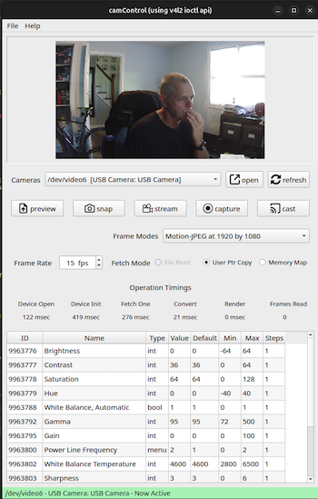

# Overview

- This document supports the camControl linux application (installable on Debian/Ubuntu/Rapbian OSs, with AMD64 or ARM64 processors)
- Installation scripts support any APT-based (apt, apt-get) package management systems.
- UVC camera access is based on [Video4Linux](https://www.kernel.org/doc/html/v4.9/media/uapi/v4l/v4l2.html) api and the [V4l2Camera](https://github.com/danlargo/v4l2Camera) open source project


<br/><br/><hr/>

# camControl App Details

- generic UVC camera control app, providing access to all USB accessible controls and image feeds for UVC compatible cameras



- can fetch and stream Motion-JPEG, YUV 422, YUV 420 and 16-bit grey-scale formats from UVC cameras (built in coversion for everything but Motion-JPEG format)
- can capture JPG, PNG and BMP snapshots
- can cast Motion-JPEG video streams via HTTP multi-part
- can capture AVI-JPEG video files (didn't want any library dependencies on install)
- camControl is based on the Qt UI api and has native support for output of JPG, BMP and PNG image formats.

- [ ] To Do - add raw MJPEG, H.264 and H.265 frame capture to video support with no re-encoding (raw dump to file)
- [ ] To Do - add RTSP and RTMP casting for Motion-JPEG, H.264 and H.265 image formats.


<br/><br/><hr/>

# Installation Details

### camControl AMD64 Install
Download [camControl.amd64.deb](./camControl/amd64/camControl.amd64.deb)
> [!IMPORTANT]
> sha256checksum :

- built and tested on Ubuntu 24.04.1 LTS, Intel(R) Core(TM) i5-7600K CPU @ 3.80Ghz
- contains binary and desktop config files to install launch icon in Ubuntu/Debian desktop

- installation command
```
sudo apt-get install ./camControl.amd64.deb

```

<br/><br/><hr/>

### camControl ARM64 Install - Raspberry Pi
Download [camControl.raspbian.deb](./camControl/raspbian-arm64/camControl.raspbian.deb)
> [!IMPORTANT]
> sha256checksum : 

- built and tested on Raspbian (Debian GNU/Linux 12 (bookworm)), ARM64 Cortex-A76 CPU @ 2.4Ghz (Pi5)
- contains binary and will install in /home/pi/Desktop, no desktop menu config files (this is the only difference between the two ARM64 installers)

- installation command
```
sudo apt-get install ./camControl.arm64.deb

```


<br/><br/><hr/>

### Qt5 Runtime

- camControl is developed and dependent on the Qt5 apis
> [!WARNING]
> In Debian 12 aka Bookworm, Qt5 is part of the baseline installation. 
>   - This is how the camControl installers are set up. (i.e. No Qt5 dependencies are included)
>   - If you want to install on Buster or Bullseye, run the following commands (depending on your OS) from the cmd line. 
>   - This should resolve any shared library issues with Qt5.

```
$ sudo apt-get update
$ sudo apt-get upgrade

# for Buster, Debian 10
$ sudo apt-get install qt5-default

# for Bullseye, Debian 11
$ sudo apt-get install qtbase5-dev qtchooser

```