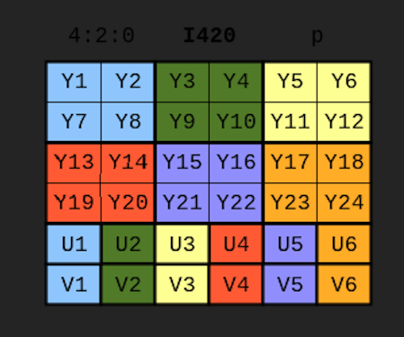
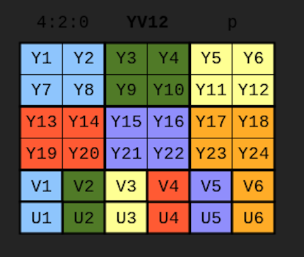
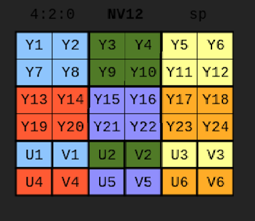
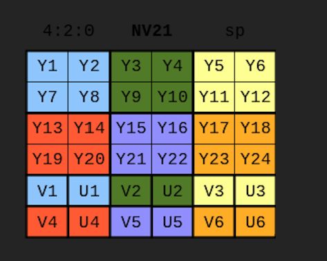

<hr/>

# Image processing functions (open source)

- During the creation of the camControl project I wanted to make the image fetch and save functions as generic as possible and not lean on any other apis or libraries
- This meant that I had to understand the various image formats that I would encounter
- I was hoping that the Qt5 apis would provide the required functi0onkaity, unfortunately that did not seem to be the case
- While many imag formats were supported (JPG and PNG) for example, some of the formats encountered in the UVC cameras had to be decoded directly
- I have included some of the decoding functions I created to save other people the the and frustration that I encountered trying to find these routines


<br/><br/><hr/>

### Image conversion flow
* Motion-JPEG (fourCC code MJPG)
    - I used the Qt5 QImage conversion capabilities directly to read the JPG image frame
    - These were then converted into QImage format, that allowed them to be saved as PNG, BMP or JPG

* YUV 420 and YUV422 formats
    - The raw frames were converted to RGB888 (not RGB32 which would have included an alpha value)
    - These were then converted into QImage format, that allowed them to be saved as PNG, BMP or JPG
* H.264, H.265
    - These frame types are not currently supported in camControl
    - The command line examples in V4l2Camera output these frame formats direectly


<br/><br/><hr/>

### Image Frame to Video flow
* My first pass at creating MP4 output files by saving the raw MJPG or H264/265 frames one by one to a MP4 file was only partially successful
    - ffmpeg is able to convert but VLC does not really understand the format...whicih makes sense as there is no header information
    - ffplay was able to play the file
* Stream to UI is "easy"
    - Images are converted from raw format (JPG or YUV)
    - Converted to QImage objects
    - Painted to UI
* Stream to File
    - currently all formats that have conversion functions (JPG, YUV 420, YUV 422) are converted to JPG and saved to AVI file
* Network Cast
    - using multi-part HTTP replies
    - Raw frames are converted to JPG and sent as multi-part JPG replies
    - Working on HTTP live streaming of AVI files


<br/><br/><hr/>

### Image Conversion Details

- Supported fourCC image formats (fetch and convert ) in camControl
    + MJPG - converts directly to QImage format
    + YUYV - YUV422, U sample first - uses [yuv422ToRGB](#yuv-422-to-rgb-conversion-function) to convert from raw to RGB888 format and then to QImage format
    + YVYU - YUV422, V sample first - uses [yvu422ToRGB](#yuv-422-to-rgb-conversion-function) to convert from raw to RGB888 format and then to QImage format
    + YU12 - Y/VU 420 - uses [planarYVU420ToRGB](#planar-non-interleaved-yuv-420-to-rgb-conversion)
    + I420 - Y/UV 420 - uses [planarYUV420ToRGB](#planar-non-interleaved-yuv-420-to-rgb-conversion)
    + NV12 - Y/UV 420 - uses [interleavedYUV420ToRGB](#interleaved-interlaced-yuv-420-to-rgb-conversion)
    + NV21 - Y/VU 420 - uses [interleavedYVU420ToRGB](#interleaved-interlaced-yuv-420-to-rgb-conversion)
    + Y16  - 16-bit Greyscale - uses [gs16ToRGB](#grey-scale-to-rgb-image-conversion)
    + Y8   - 8-it Greyscale - uses [gs8ToRGB](#grey-scale-to-rgb-image-conversion)
    + Y800 - same as Y8
    + GREY - same as Y8

- These functions are a result of extensive but not exhaustive searching. I ended up finding this information in bits and pieces across many different web sites
- I did not keep track of any of the reference sites (sorry) although wikipedia and stack overflow were a great source, but sometimes conflicting source, of information

- This is obviously not a comprehensive list of conversion functions, and the first place I would turn if I wanted to integrate well know iomage and video processing APIs would be :
    * [imagemagick](https://imagemagick.org/index.php)
    * [graphicsmagick](http://www.graphicsmagick.org/)
    * [ffmpeg](https://www.ffmpeg.org/)
    * [vlc](https://www.videolan.org/vlc/)
    * [opencv](https://opencv.org/)
    * I am sure there are lots of other good ones that I didn;t have time to research in more detail
    
- I created the routines below because I was trying to understand the basics of frame formats in the UVC cameras and not looking to intergate a massive API into the system

> [!CAUTION]
> Use these algorithms at your own risk :)
>   - They seem to produce images that "look" right but may not be pixel perfect.
>   - If you have suggestions for improving them please let me know.


<br/><br/><hr/>

### Conversion Functions
<hr/>

#### YUV to R, G, B conversion factors

- Interestingly I found that there are many different opinions on the "correct" way to convert YUV values to RGB components.
- I got tired of updating each image conversion routine each time I found a new formula, so I coded them into routines that could be changed all in one place.
- The basic conversion factors I used were :
    * R = Y + (1.4065 * (U - 128))
    * G = Y - (0.3455 * (V - 128)) - (0.7169 * (U - 128))
    * B = B = Y + (1.7790 * (V - 128))

- Some variations of these formulas include:
    * R = Y + 1.140V, G = Y - 0.395U - 0.581V, B = Y + 2.032U
    * R = 1.164 * Y + 1.596 * V, G = 1.164 * Y - 0.392 * U - 0.813 * V, B = 1.164 * Y + 2.017 * U;

- I tried each of them and they seem to generate only small changes in the output image format


```
unsigned char R_fromYUV( int Y, int U, int V )
{
    double R = Y + (1.4065 * (U - 128));

    // This prevents colour distortions in your rgb image
    if (R < 0) R = 0;
    else if (R > 255) R = 255;

    return (unsigned char)R;
}

unsigned char G_fromYUV( int Y, int U, int V )
{
    double G = Y - (0.3455 * (V - 128)) - (0.7169 * (U - 128));

    // This prevents colour distortions in your rgb image
    if (G < 0) G = 0;
    else if (G > 255) G = 255;

    return (unsigned char)G;
}

unsigned char B_fromYUV( int Y, int U, int V )
{
    double B = Y + (1.7790 * (V - 128));

    // This prevents colour distortions in your rgb image
    if (B < 0) B = 0;
    else if (B > 255) B = 255;

    return (unsigned char)B;
}
```
<hr/>

#### Grey Scale to RGB image conversion

- The simplest image format to convert was the grey scale formats
- Images are a list of either 8 or 16-bit values for each pixel
- A simple encoding mechanism into RGB is to make each component value (R, G, B) the same and equivalent to the grey scale value
- Given RGB was 8 bits per pixel both 8 and 16 bit grey scale converted into the same format
    - The extra resolution in the 16-bit grey scale is lost when converting to RGB
- I haven't spent more time on this to try to create output images that capture the extra reolution of the 16-bit grey scale, although I suspect the QImage and the native bitmap formats in Qt support 16 bit greay scale at higher resolution

```
// linear 16 bit grey scale values
//
unsigned char * gs16ToRGB( unsigned char * yuv_image, int width, int height, bool grayScale )
{
    unsigned char* rgb_image = new unsigned char[width * height * 3];

    //width and height of the image to be converted

    int outIndex = 0;

    // increment across two bytes for each sample
    //
    for( int ii = 0; ii < width*height*2; ii+=2 )
    {
        // just use the upper byte
        // we could convert and then downscale but you would end up with the upper byte anyway
        //
        // (byte1*256 + byte2 ) / 256 => byte1
        //
        int R = yuv_image[ii];

        rgb_image[outIndex++] = R;
        rgb_image[outIndex++] = R;
        rgb_image[outIndex++] = R;
    }

    return rgb_image;
}


// linear 8-bit grey scale values
//
unsigned char * gs8ToRGB( unsigned char * yuv_image, int width, int height, bool grayScale )
{
    unsigned char* rgb_image = new unsigned char[width * height * 3];

    //width and height of the image to be converted

    int outIndex = 0;

    // increment by 1 byte
    //
    for( int ii = 0; ii < width*height*2; ii++ )
    {
        // single grey scale byte to R and G and B
        //
        int R = yuv_image[ii];

        rgb_image[outIndex++] = R;
        rgb_image[outIndex++] = R;
        rgb_image[outIndex++] = R;
    }

    return rgb_image;
}
```

<hr/>

#### YUV 422 to RGB conversion function

- YUV 4:2:2, shares U and V values between two Y values
- fourcc:YUYV pixel coding is : Y0 U0 Y1 V0   Y1 U1 Y3 V1
- fourcc:YVYU pixel coding is : Y0 V0 Y1 U0   Y1 V1 Y3 U1

```
unsigned char * yuv422ToRGB( unsigned char * yuyv_image, int width, int height, bool grayScale )
{
    // return image array
    unsigned char* rgb_image = new unsigned char[width * height * 3];

    int Y, U, V;
    unsigned char R, G, B;

    for( int i = 0, j = 0; i < width * height * 3; i+=6, j+=4 )
    {
        //first pixel
        Y = yuyv_image[j];
        V = yuyv_image[j+1];
        U = yuyv_image[j+3];

        R = R_fromYUV( Y, U, V );
        G = R;
        B = R;
        if( !grayScale )
        {
            G = G_fromYUV( Y, U, V );
            B = B_fromYUV( Y, U, V );
        }

        rgb_image[i] = R;
        rgb_image[i+1] = G;
        rgb_image[i+2] = B;

        //second pixel
        Y = yuyv_image[j+2];
        V = yuyv_image[j+1];
        U = yuyv_image[j+3];

        R = R_fromYUV( Y, U, V );
        G = R;
        B = R;
        if( !grayScale )
        {
            G = G_fromYUV( Y, U, V );
            B = B_fromYUV( Y, U, V );
        }

        rgb_image[i+3] = R;
        rgb_image[i+4] = G;
        rgb_image[i+5] = B;
    }

    return rgb_image;
}
```
<hr/>

### Planar (non-interleaved) YUV 420 to RGB conversion


```
// Planar (Non-Interleaved) YUV 420 format definition
//
// Y - Luminence, one byte per pixel in first section of file
//
//      00 01 02 03 04 05 06 07                etc
//      08 09 10 11 12 13 14 15
//      ...
//
// U (Cr) - Chroma, one byte per 4 pixels
//
//      00 01 02 03 04 05 06 07                 etc
//      ..
//
//      with mapping of Y =
//      00 01
//      08 09       ==> mapping to 00 of U (Cr)
//
// V (Cb) = Chroma, one byte per 4 pixels
//
//      00 01 02 03 04 05 06 07                 etc
//      ..
//
//      with mapping of Y =
//      00 01
//      08 09       ==> mapping to 00 of V (Cb)
//
//
// File size is (width*height = size)
// Y - size bytes, followed by
// U - size/4 bytes, followed by
// V - size/4 bytes
//
//
unsigned char * planarYUV420ToRGB( unsigned char * yuv_image, int width, int height, bool grayScale )
{
    // output buffer
    unsigned char* rgb_image = new unsigned char[width * height * 3];

    // width and height of the image to be converted
    int size = width * height;
    int sizeU = size/4;

    int outIndex = 0;

    int Y, U, V;
    double R, G, B;

    for( int ii = 0; ii < size; ii++ )
    {
        // get mappings from    00 01       (width = 8, size = width*height)
        //                      08 09
        //                                  to U = size + 00
        //                                  and V = size + (sizeU) + 00
        //
        // offsetU = size + (ii%width) / 2
        // offsetV = sizeU + (ii%width) / 2
        //

        Y = yuv_image[ii];
        int offsetUV = (ii%width) / 2;

        U = yuv_image[size + offsetUV];
        V = yuv_image[size + sizeU + offsetUV];

        R = R_fromYUV( Y, U, V );
        G = R;
        B = R;

        if( !grayScale )
        {
            G = G_fromYUV( Y, U, V );
            B = B_fromYUV( Y, U, V );
        }

        rgb_image[outIndex++] = R;
        rgb_image[outIndex++] = G;
        rgb_image[outIndex++] = B;

    }

    return rgb_image;
}
```



```
// same as above but U and V samples are reversed
//

unsigned char * planarYVU420ToRGB( unsigned char * yuv_image, int width, int height, bool grayScale )
{
    // output buffer
    unsigned char* rgb_image = new unsigned char[width * height * 3];

    // width and height of the image to be converted
    int size = width * height;
    int sizeUV = size/4;

    int outIndex = 0;

    int Y, U, V;
    double R, G, B;

    for( int ii = 0; ii < size; ii++ )
    {
        // get mappings from    00 01       (width = 8, size = width*height)
        //                      08 09
        //                                  to V = size + 00
        //                                  and U = size + (sizeU) + 00
        //
        // offsetV = size + (ii%width) / 2
        // offsetU = sizeV + (ii%width) / 2
        //

        Y = yuv_image[ii];
        int offsetUV = (ii%width) / 2;

        V = yuv_image[size + offsetUV];
        U = yuv_image[size + sizeUV + offsetUV];

        R = R_fromYUV( Y, U, V );
        G = R;
        B = R;

        if( !grayScale )
        {
            G = G_fromYUV( Y, U, V );
            B = B_fromYUV( Y, U, V );
        }

        rgb_image[outIndex++] = R;
        rgb_image[outIndex++] = G;
        rgb_image[outIndex++] = B;

    }

    return rgb_image;
}
```

<hr/>

### Interleaved (interlaced) YUV 420 to RGB conversion



```
// Interleaved YUV 420 format definition
//
// Y - Luminence, one byte per pixel in first section of file
//
//      00 01 02 03 04 05 06 07                etc
//      08 09 10 11 12 13 14 15
//      ...
//
// U, V (Cr, Cb) - Chroma, one alternating bytes per 4 pixels
//
//      U0 V0 U1 V1 U2 V2 U3 V3                 etc
//      ..
//
//      with mapping of Y =
//      00 01
//      08 09       ==> mapping to 00 of U (Cr) and 00 of V (Cb)
//
//      and
//      02 03
//      10 11       ==> mapping to 01 of U (Cr) and 01 of V (Cb)
//
// File size is (width*height = size)
// Y - size bytes, followed by
// U/V - size/2 bytes, followed by
//
//
unsigned char * interleavedYUV420ToRGB( unsigned char * yuv_image, int width, int height, bool grayScale )
{
    // output buffer
    unsigned char* rgb_image = new unsigned char[width * height * 3];

    // width and height of the image to be converted
    int size = width * height;

    int outIndex = 0;

    int Y, U, V;
    double R, G, B;

    for( int ii = 0; ii < size; ii++ )
    {
        // get mappings from    00 01       (width = 8, size = width*height)
        //                      08 09
        //                                  to  U = size + 00
        //                                  and V = size + 01
        //
        // get mappings from    02 03       (width = 8, size = width*height)
        //                      10 11
        //                                  to  U = size + 02
        //                                  and V = size + 03
        //
        // offsetU = size + (ii%width) / 2
        //

        Y = yuv_image[ii];
        int offsetUV = (ii%2)*2;

        U = yuv_image[size + offsetUV];
        V = yuv_image[size + offsetUV + 1];

        R = R_fromYUV( Y, U, V );
        G = R;
        B = R;

        if( !grayScale )
        {
            G = G_fromYUV( Y, U, V );
            B = B_fromYUV( Y, U, V );
        }

        rgb_image[outIndex++] = R;
        rgb_image[outIndex++] = G;
        rgb_image[outIndex++] = B;

    }

    return rgb_image;
}
```



```
// same algorithm as above, with U and V reversed in the interleaving
//
unsigned char * interleavedYVU420ToRGB( unsigned char * yuv_image, int width, int height, bool grayScale )
{
    // output buffer
    unsigned char* rgb_image = new unsigned char[width * height * 3];

    // width and height of the image to be converted
    int size = width * height;

    int outIndex = 0;

    int Y, U, V;
    double R, G, B;

    for( int ii = 0; ii < size; ii++ )
    {
        // get mappings from    00 01       (width = 8, size = width*height)
        //                      08 09
        //                                  to  U = size + 00
        //                                  and V = size + 01
        //
        // get mappings from    02 03       (width = 8, size = width*height)
        //                      10 11
        //                                  to  U = size + 02
        //                                  and V = size + 03
        //
        // offsetU = size + (ii%width) / 2
        //

        Y = yuv_image[ii];
        int offsetUV = (ii%2)*2;

        V = yuv_image[size + offsetUV];
        U = yuv_image[size + offsetUV + 1];

        R = R_fromYUV( Y, U, V );
        G = R;
        B = R;

        if( !grayScale )
        {
            G = G_fromYUV( Y, U, V );
            B = B_fromYUV( Y, U, V );
        }

        rgb_image[outIndex++] = R;
        rgb_image[outIndex++] = G;
        rgb_image[outIndex++] = B;

    }

    return rgb_image;
}

```